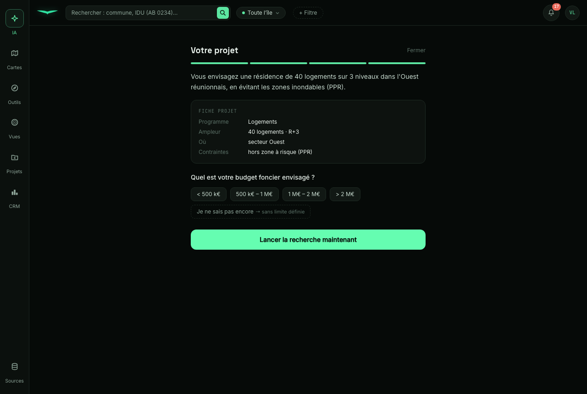
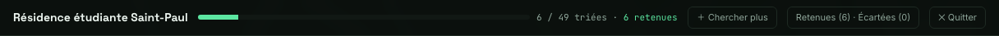
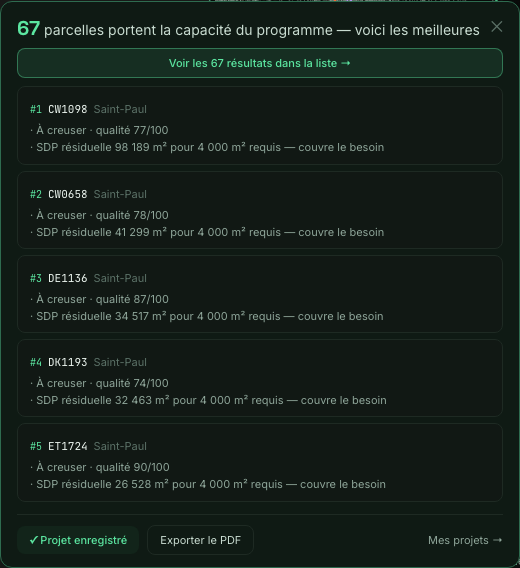
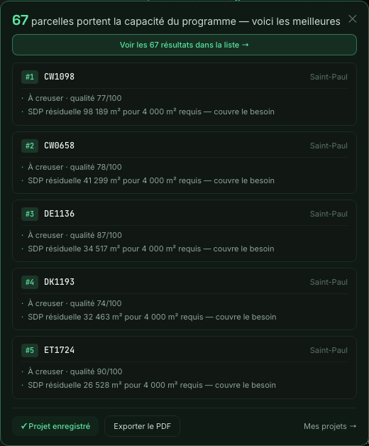
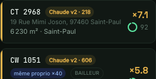
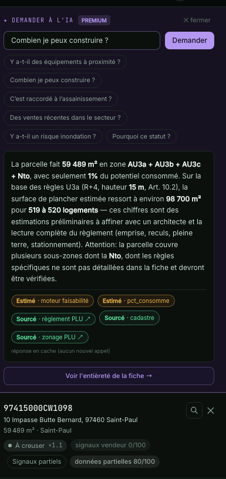
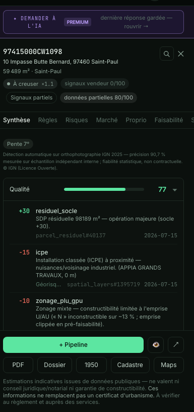
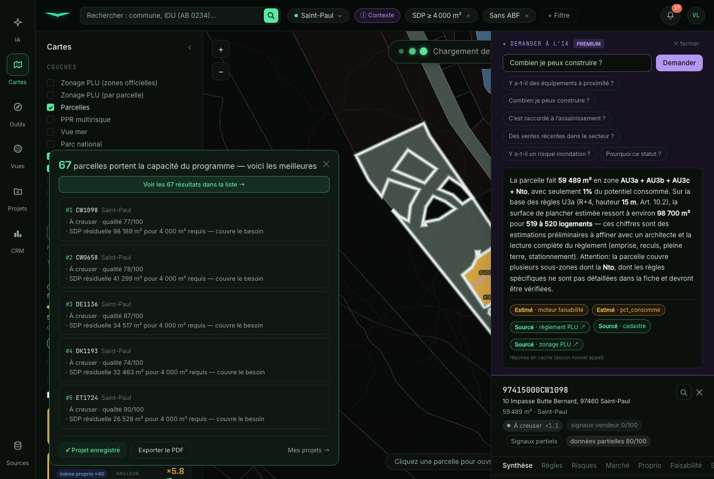

# FIX post-validation 1 — bug cadrage + 4 UX

**Branche** : `feat/fix-post-validation` (pas de merge — validation + merge par Vic).
**Origine** : tour de validation visuelle de Vic (20/07). 1 bug réel (cadrage) + 4 UX.
**Périmètre** : zéro touche scoring / cascade / étage 0 / run servi `q_v6_m8`. Aucune
restructuration de la partie projet (refonte = mandat séparé). Chaque fix = un commit séparé.

Captures dans `reports/post-validation/captures/`.

---

## Lot 0 — Constat (lecture seule)

### Fix A (bug) — d'où sort `niveaux`
- **Appel** : `POST /ia/entretien` (entretien de cadrage projet, copilote-projet), `src/labuse/api/ia.py`.
- **Schéma** : `ENTRETIEN_SCHEMA` → `FICHE_SCHEMA` (`src/labuse/api/projet_schema.py`). La fiche a un
  **vocabulaire fermé** (`additionalProperties: false`) : le champ `niveaux` (gabarit R+n) **existe**,
  mais **uniquement à l'intérieur de `ampleur`** (`fiche.ampleur.niveaux`).
- **Cause exacte** : le prompt demande bien « R+3 → `ampleur.niveaux` 3 » (ia.py L541), mais le modèle
  **aplatit** parfois la donnée et l'émet à la **racine de la fiche** (`fiche.niveaux`). Le garde-fou
  `additionalProperties: false` rejette alors *tout* l'entretien → message
  « cadrage non conforme (Additional properties are not allowed ('niveaux' was unexpected)) — réessayez ».
- **Reproduction déterministe** (avant fix) :
  ```
  fiche = {"type_programme":"logements","ampleur":{"logements":40},"niveaux":3, ...}
  → REPRO OK — rejet : Additional properties are not allowed ('niveaux' was unexpected)
  ```
- **Nature** : `niveaux` est une **donnée légitime** du cadrage, juste **mal placée**. Donc : on la
  **récupère** (relocate) — on ne la perd pas — ET on rend le cadrage **robuste** à tout champ inattendu.

### Fix D — badges concernés
- `frontend/src/components/panel/ResultsSection.tsx` : le badge **×N** (`ResultCard`, `mult_v2`) et
  l'**anneau de complétude** (`CompletudeRing`, valeur `completeness_score`, ex. « 92 »).

### Fix E — état de l'AskBar après réponse
- `frontend/src/components/fiche/AskBar.tsx` : dépliée, la réponse IA (texte + chips de provenance)
  s'insère **au-dessus** de la fiche et **repousse les onglets** vers le bas ; seul le « ✕ fermer »
  (discret, en haut) permettait de replier.

---

## FIX A — cadrage `niveaux` robuste — PRIORITAIRE  *(commit 0480956)*

**Fix** (`projet_schema.py` + `ia.py`) :
1. `relocate_niveaux(fiche)` — un `niveaux` à la racine est **remis dans `ampleur`** (jamais perdu ;
   n'écrase pas une valeur déjà bien placée ; idempotent).
2. `prune_to_schema(data, schema)` — retire **récursivement** tout champ hors vocabulaire d'un objet
   fermé (objets **et** tableaux d'objets) **au lieu de faire échouer** la validation, et **renvoie la
   liste des champs retirés** (journalisés via `entretien-champs-ignores`). Le garde-fou schéma reste
   en dernier recours pour les **valeurs** (enums).
3. Câblé dans `/ia/entretien` avant `validate(...)`.

**Preuve** :
- **Live** — l'entretien qui échouait aboutit : 
  Fiche « Ampleur : 40 logements · R+3 », périmètre Ouest, contrainte PPR → bouton **« Lancer la
  recherche »**. Endpoint réel : `fallback: None`, `fiche.ampleur.niveaux = 3`.
- **Déterministe** — `tests/test_cadrage_niveaux.py`, **7 tests** : reproduction exacte du bug,
  récupération du `niveaux`, robustesse (champs inattendus à tous les niveaux retirés + loggés),
  idempotence, non-régression d'une fiche déjà valide. `7 passed`.

---

## FIX B — boutons du parcours plus visibles  *(commit 98ae2d1)*

**Fix** (`ParcoursTinder.tsx`) — hiérarchie visuelle par la charte, sans refonte :
- **＋ Chercher plus** : teinte **menthe** (action positive, la plus contrastée).
- **Retenues · Écartées** : fond `surface-3`, texte lisible, **compteurs colorés** (menthe / rouge) pour
  le scan.
- **✕ Quitter** : **sobre** (ne concurrence pas les actions).

**Preuve** : avant →  · après →


---

## FIX C — nettoyage de la carte restitution  *(commit 921ee91)*

**Fix** (`App.tsx`, restitution large) — aérer et hiérarchiser (nettoyage léger, pas de refonte) :
- En-tête par parcelle : **pastille `#rang`** (menthe) · **IDU en avant** (mono, medium) · **commune
  alignée à droite**.
- Le « pourquoi » séparé par un **filet**, puces **menthe** alignées, interlignage aéré.

**Preuve** : avant →  · après →


---

## FIX D — tooltips ×N et complétude  *(commit 81e477f)*

**Fix** (`ResultsSection.tsx`) — le « 92 » que Vic ne comprenait pas devient explicite :
- **×N** → « **Multiplicateur du score P (scoring v2 servi) : probabilité de mutation ×N vs la moyenne
  du parc.** » (libellé exact du scoring servi — le ×N est un rapport à la moyenne du parc, pas au rang).
- **Anneau N/100** → « **Complétude des données : part des sources disponibles pour cette parcelle
  (N %). N'entre pas dans le score d'opportunité.** »

**Preuve** : badges  (×7.1 et anneau « 92 »). Le **texte exact** des tooltips
(les `title` natifs ne se capturent pas en image) est extrait du DOM à l'exécution :
```
×N        : Multiplicateur du score P (scoring v2 servi) : probabilité de mutation ×7.1 vs la moyenne du parc.
complétude: Complétude des données : part des sources disponibles pour cette parcelle (92 %). N'entre pas dans le score d'opportunité.
```

---

## FIX E — repli IA « Voir l'entièreté de la fiche »  *(commit d21a0f8)*

**Fix** (`AskBar.tsx`) — sous la réponse IA, un **lien clair** replie **toute** la zone (réponse
comprise) et rend la place à la fiche. La réponse **reste gardée** : le bouton replié indique
« **dernière réponse gardée — rouvrir** » et la ré-affiche au clic (**cache inchangé, aucun nouvel
appel**). Le « ✕ fermer » existant reste.

**Preuve (2 états)** :
- Réponse affichée **avec le lien** : 
- Après clic — **fiche entière** (onglets, Qualité, lignes de score, actions) + bouton
  « dernière réponse gardée » : 
- (Contexte avant :  — la réponse masquait les onglets, seul
  « ✕ fermer » repliait.)

---

## Non-régression & garanties

- **Zéro touche scoring** (`git diff --name-only 71dd3e6 HEAD`) : aucun fichier
  `scoring/ · cascade/ · etage0 · p_v2 · score_v · run · segments · mutation · shortlist`. Fichiers
  modifiés : `ia.py`, `projet_schema.py` (FIX A) + 4 composants front + 1 test.
- **Surface A** (ask / cache / provenance) : fonctionnelle — cf. E-reponse-after (réponse sourcée,
  chips Sourcé/Estimé, « réponse en cache (aucun nouvel appel) »).
- **Parcours de tri** : fonctionnel — cf. B (progression, décisions, compteurs).
- **Restitution** : fonctionnelle — cf. C (compteur + top + pourquoi + Enregistrer/PDF).
- **0 erreur console** sur tous les scénarios de capture (Playwright).
- Tests : `tests/test_cadrage_niveaux.py` **7/7**. Imports serveur OK. Front `tsc -b && vite build` OK.

## STOP — à Vic
1. **Bug cadrage** : cause = `niveaux` émis à la racine de la fiche (aplatissement modèle) rejeté par
   `additionalProperties:false` ; fix = récupération dans `ampleur` + robustesse générale ; **l'entretien
   aboutit** (A-cadrage-aboutit.png + 7 tests).
2. **Boutons parcours** (B avant/après). 3. **Restitution nettoyée** (C avant/après).
4. **Les 2 tooltips** (D + texte DOM). 5. **Repli IA** (E, 2 états).
6. **Zéro scoring** (git diff).

Commits séparés sur `feat/fix-post-validation`, **pas de merge**.
