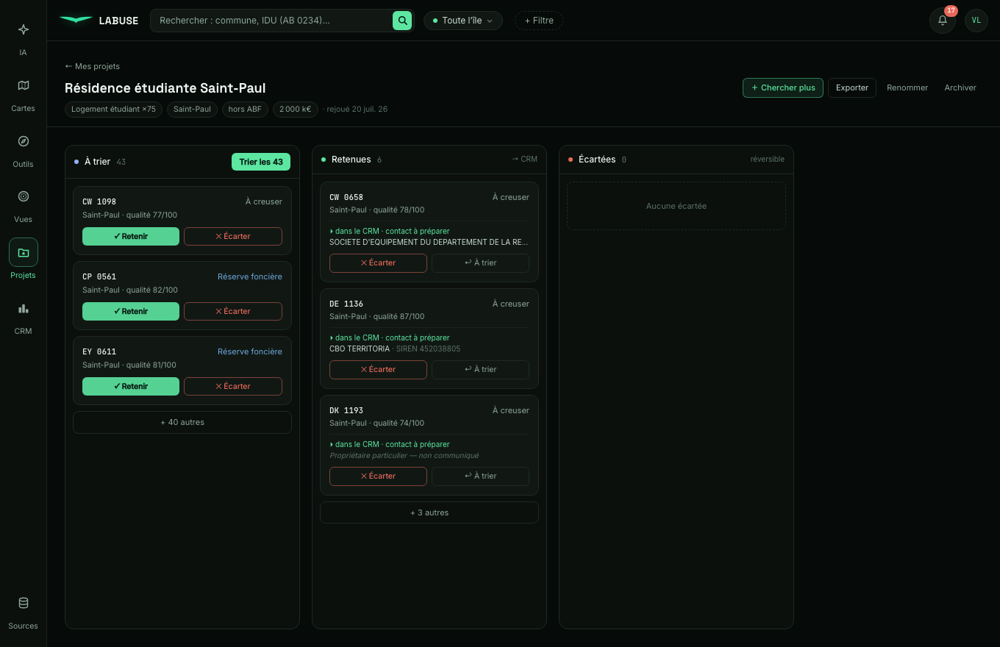
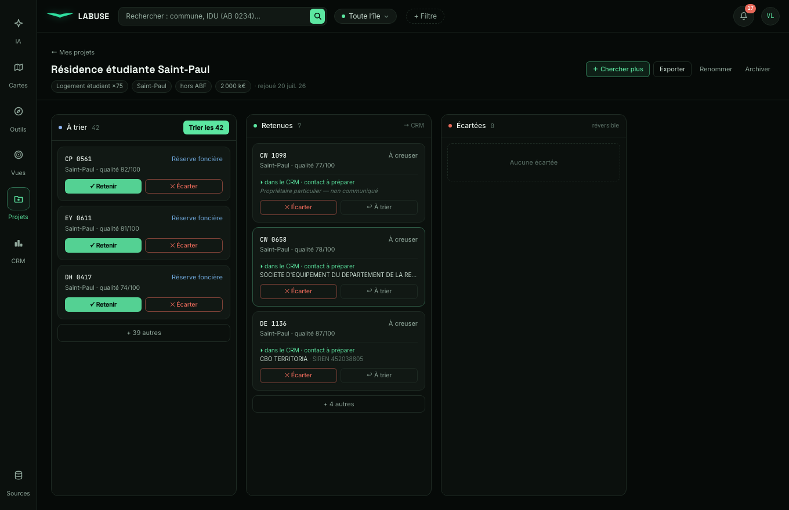
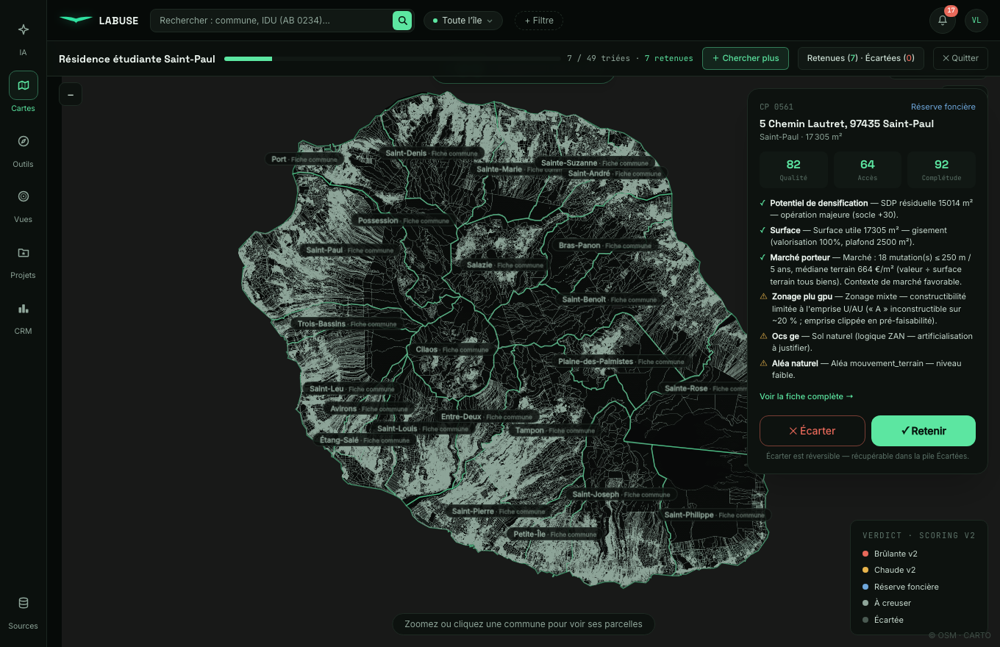
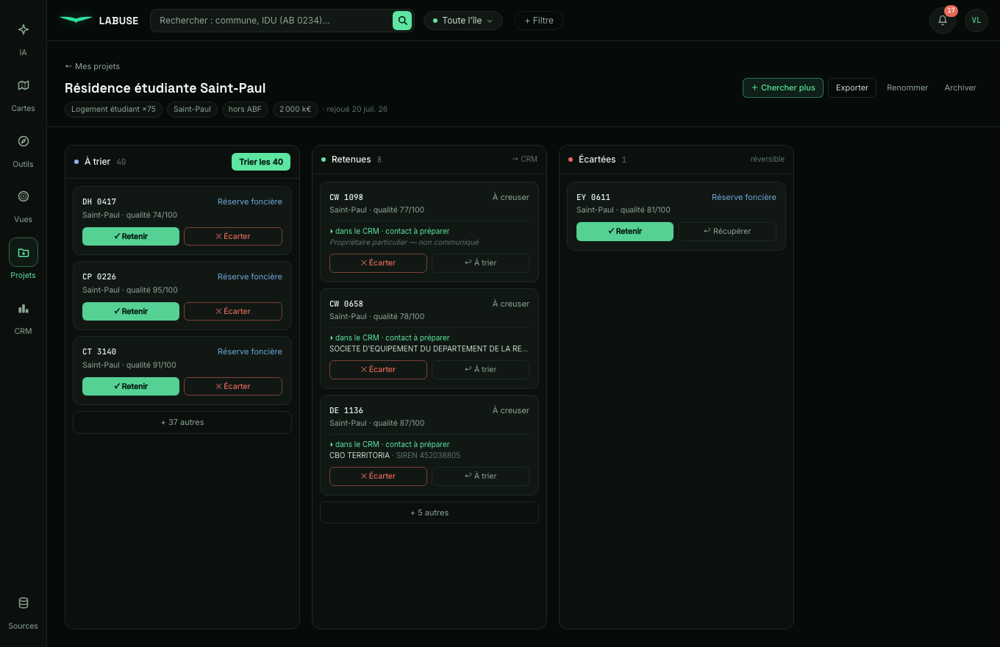
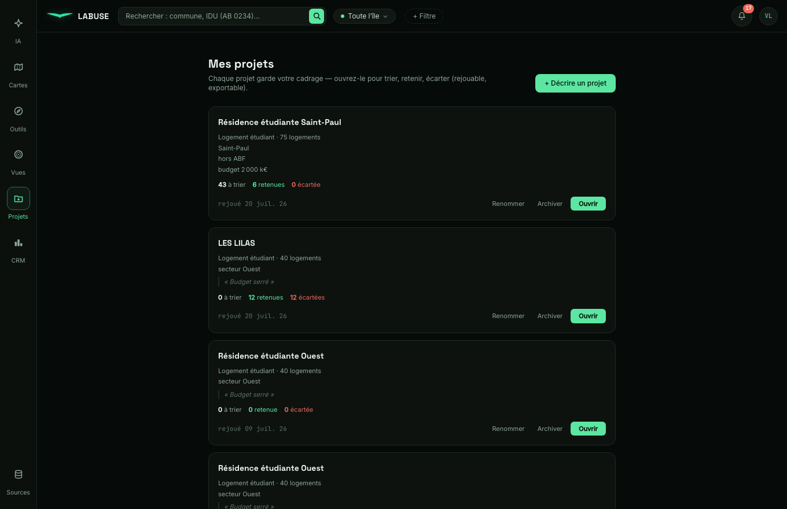
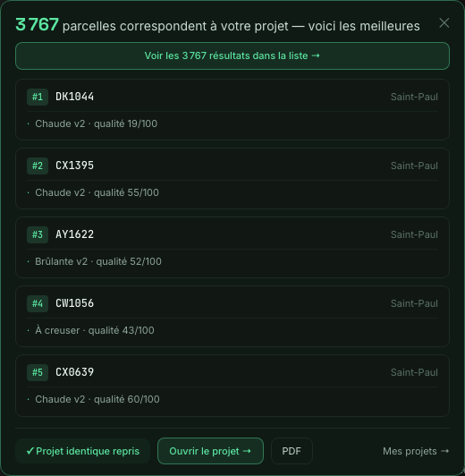

# Projet unifié (PJ3 + PJ8) — fusion des deux mondes

**Branche** : `feat/projet-unifie` (basée sur `main` = fix post-validation mergé). **Pas de merge** —
validation + merge par Vic. **Zéro touche scoring / cascade / étage 0 / run q_v6_m8.**
Captures : `reports/post-validation/captures-projet/`.

---

## Lot 0 — Audit des deux mondes (IMPÉRATIF, lecture seule)

### La vue « Ouvrir » actuelle
`ProjetsPanel` → `rejouer` appelait **deux** choses :
1. `POST /projets/{id}/rejouer` — horodate `derniere_execution_at`, rien d'autre.
2. `POST /projets/apercu` (`getApercu(fiche)`) — **relance une recherche LIVE** depuis les filtres
   dérivés de la `fiche` (M22 si programme, sinon run q_v2) et renvoie `n` = **compte total** +
   top 5. Puis `setIaRestitution(...)` → la carte flottante « N parcelles portent la capacité ».

→ `/apercu` **ne lit JAMAIS `projet_parcelles`**. Le « 52 » est le **compte de la recherche**, pas
les retenues. **C'est pourquoi « Ouvrir » ignorait le tri** : il ré-affichait une recommandation
figée, indépendante de ce que l'utilisateur avait retenu/écarté.

### Le parcours « Trier »
`openParcours` → `ParcoursTinder` : `POST /proposer` (upsert du top de recherche dans
`projet_parcelles` en `proposee`, **non destructif** `ON CONFLICT DO NOTHING`) puis
`GET /parcelles` (lecture de `projet_parcelles` groupé par statut). Le tri écrit `retenue`/`ecartee`.

### Les 52 = même liste que les proposées ?
**Même moteur, même requête** (`_search_items` et `/apercu` partagent `derive_filtres` + M22/q_v2).
La divergence n'est PAS un calcul différent : `/apercu` renvoie le **compte total** (52) et **ignore
le tri** ; `/proposer` **matérialise** un top (24) dans `projet_parcelles` où vivent les statuts. Les
deux mondes n'étaient **jamais joints** — d'où le « bloqué sur 52 ». **Cause structurelle = aucune,
la table `projet_parcelles` est déjà la bonne source unique ; il suffisait d'y brancher la vue d'entrée.**

### Les doublons
`POST /projets` (`projet_create`) **n'a jamais vérifié l'existant** → chaque « Enregistrer » insérait.
Les 4 « Résidence étudiante Ouest » = 4 créations à fiche identique.

### Drag & drop — lib existante ?
**Aucune lib DnD** (`package.json`). Le Kanban CRM utilise le **Drag & Drop HTML5 natif**
(`draggable` + `onDragStart`/`onDragOver`/`onDrop`). → **réutilisé tel quel**, zéro dépendance ajoutée.

**Verdict** : pas d'obstacle structurel. La fusion = faire lire `projet_parcelles` à la vue d'entrée,
garantir les proposées à l'ouverture, une seule mutation de statut pour drag/Tinder/boutons.

---

## Lot 1 — Vue projet unifiée (kanban 3 colonnes)  *(commit ca0e6ed)*

`ProjetKanban.tsx` + store `openProjet`. **« Ouvrir » mène ici** ; l'ancienne restitution figée n'est
plus la vue d'entrée. Header (nom, critères en chips, « rejoué le X », Chercher plus / Exporter /
Renommer / Archiver). **3 colonnes** À trier / Retenues / Écartées, **en aperçu** (2-3 cartes +
« + N autres »), **compteurs vivants**. Retenues : « ▸ dans le CRM · contact à préparer » + **proprio**
(PM nommée / « Propriétaire particulier — non communiqué »). Écartées : « réversible » + « ↩ Récupérer ».
À l'ouverture : `proposer` idempotent → « À trier » jamais vide.

**Preuve** (vraies données Vic) :  — 43 à trier · 6 retenues · 0 écartée.

## Lot 2 — Drag & drop entre colonnes  *(commit ca0e6ed)*

DnD **natif HTML5** (pattern CRM, zéro lib). Un drop appelle **`setStatutParcelle`** — **la même
mutation** que le Tinder ET les boutons de repli (fallback accessibilité/mobile : ✓ Retenir / ✕ Écarter /
↩ À trier sur chaque carte). Colonne de dépôt surlignée (menthe). Auto-CRM synchronisé.

**Preuve** : avant  → après
. Console : `CW1098 : À trier 43→42 · Retenues 6→7` et
**`CRM (pipeline) : avant false → après true`** (synchro auto au drop).

## Lot 3 — Tri Tinder branché sur la vue  *(commit ca0e6ed)*

« Trier les N » (tête de colonne) → **ParcoursTinder existant** sur les parcelles à trier. « Quitter »
→ `setOpenProjet` → **retour sur le kanban** (pas la liste), à jour. **Une seule source de vérité** :
la vue et le tri partagent la query `['parcours', pid]` (statuts `projet_parcelles`). **Le « bloqué
sur 52 » est mort.**

**Preuve** : tri  → retour
. Console : `Retenues 7→8`, une écartée apparaît
(EY 0611, avec « ↩ Récupérer »). Ce que je trie se reflète dans la vue, toujours.

## Lot 4 — Liste « Mes projets » en fiches + dédup  *(commits ca0e6ed + 67c89ca + b34d0a2)*

Cartes **redessinées en fiches** : nom, critères, **mini-compteurs** (N à trier · N retenues · N
écartées, depuis `projet_parcelles`), dernière activité, UN bouton principal **« Ouvrir »** (le
« Trier les parcelles » a disparu — le tri vit dans le projet). **Dédup DOUCE** à la création : un
projet actif aux **mêmes critères** (filtres) ou **même nom** renvoie l'existant (`existing:true`) →
« ✓ Projet identique repris » + « Ouvrir le projet → ». **Les doublons déjà en base ne sont jamais
supprimés** (Vic archive lui-même).

**Preuve** : fiches  (mini-compteurs ; les 4 « Ouest »
doublons de Vic subsistent) · dédup  (« ✓ Projet identique repris »).

---

## Non-régression & garanties

- **Zéro touche scoring** (`git diff --name-only eff9b10 HEAD`) : aucun fichier
  `scoring/ · cascade/ · etage0 · p_v2 · score_v · run · segments · mutation · shortlist`. Modifiés :
  `projets.py` (backend), `App.tsx`, `ParcoursTinder.tsx`, `ProjetKanban.tsx` (nouveau), `ProjetsPanel.tsx`,
  `api.ts`, `useApp.ts`.
- **Une seule logique de statut** : drag, Tinder et boutons appellent tous `setStatutParcelle`
  (`PATCH /projets/{id}/parcelle/{idu}`) → `_sync_crm_retenue`. Aucune duplication par chemin d'entrée.
- **CRM synchro, aller-retour sans orpheline** (vérifié API) : retenue→écartée **retire** l'entrée
  pipeline (`DELETE ... WHERE projet_id`), écartée→retenue la **recrée**. `False→True` prouvé.
- **CRM (Kanban pipeline) intact** : `/pipeline` 200, 21 entrées (15 liées à un projet). Cartes CRM inchangées.
- **PRIVACY** : les retenues exposent la PM (public DGFiP, SIREN) ; le particulier n'est **jamais nommé**
  (« non communiqué ») — helper `_proprietaire_public` réutilisé, ligne rouge respectée.
- **Reprise d'état** : fermer/rouvrir un projet relit `projet_parcelles` ; le tri Tinder reste
  fonctionnel et alimente la même table.
- Front `tsc -b && vite build` OK. **0 erreur console** sur tous les scénarios de capture.

## STOP — à Vic
1. **Audit Lot 0** : « Ouvrir » relançait `/apercu` (recherche live, compte total) et **ignorait
   `projet_parcelles`** → les 52 étaient le compte de recherche, jamais les retenues ; même moteur que
   les proposées mais **jamais joints**. Doublons = `create` sans check. DnD = natif HTML5 (CRM), réutilisé.
2. **Vue unifiée** (L1, vraies données). « Ouvrir » y mène.
3. **Drag & drop** (L2 avant/après) + **CRM synchro** (false→true).
4. **Tri branché** (L3) : trier → revenir → kanban à jour. Le « bloqué sur 52 » est mort.
5. **Fiches projets + dédup** (L4).
6. **Zéro scoring**, CRM intact, aller-retour sans orpheline.

Commits séparés sur `feat/projet-unifie`, **pas de merge**.
