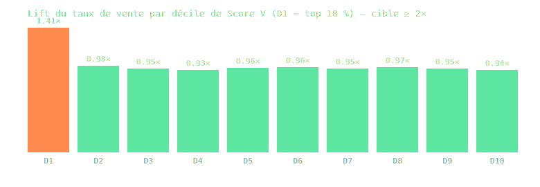

# Backtest Score V — lift du décile supérieur

- Cohorte : **20768** parcelles vendues (DVF 'Vente' 2023-01-01 → 2025-12-31) vs **83072** non-vendues (stratifiées commune, ×4, seed 974).
- Recalcul V à **T−12 mois** avant vente (signaux datés ≤ T uniquement) ; non-vendues à T réf. = 2023-05-31 (médiane des ventes −12 mois). 12049 parcelles V=NULL exclues (publics/bailleurs).
- Taux de vente de base : 0.201.

## Résultat : lift top décile = **1.41×**

🔴 **LIFT < 1.5× : poids à retravailler avant tout usage commercial du score.**

| Décile | V min–max | n | Taux de vente | Lift |
|---|---|---|---|---|
| D1 | 0–73 | 9179 | 0.284 | **1.41×** |
| D2 | 0–0 | 9179 | 0.197 | **0.98×** |
| D3 | 0–0 | 9179 | 0.191 | **0.95×** |
| D4 | 0–0 | 9179 | 0.187 | **0.93×** |
| D5 | 0–0 | 9179 | 0.192 | **0.96×** |
| D6 | 0–0 | 9179 | 0.194 | **0.96×** |
| D7 | 0–0 | 9179 | 0.191 | **0.95×** |
| D8 | 0–0 | 9179 | 0.195 | **0.97×** |
| D9 | 0–0 | 9179 | 0.191 | **0.95×** |
| D10 | 0–0 | 9180 | 0.188 | **0.94×** |

## Lift par bande de score (coupe produit, sans artefact d'ex æquo)

| Bande | n | Taux de vente | Lift |
|---|---|---|---|
| V ≥ 50 (fort) | 30 | 0.167 | **0.83×** |
| V 25-49 (présents) | 1692 | 0.204 | **1.02×** |
| V 9-24 (faible, au-delà de la tenure seule) | 3019 | 0.455 | **2.26×** |
| V = 8 (tenure seule) | 6 | 0.167 | **0.83×** |
| V 0-7 | 87044 | 0.192 | **0.96×** |

## Caveats (à lire avant tout usage commercial)
- **DGFiP PM = millésime 2025** : pour une vente 2023-2025, le fichier peut déjà porter l'acheteur → fuite temporelle familles A/B/C (elle joue plutôt CONTRE le lift).
- Fenêtre DVF 2021+ : tenure OBS5 tronquée à T (2-4 ans d'observation).
- Friches et siège : millésimes courants, pas d'historique public.
- Famille E (DPE) non testée à T−12 : 43 F/G sur l'île — volume insuffisant pour peser.
## Lecture v1.1 (après calibration)

- **V 9-24 : 2,26×** (v1 : 2,13×) — le cœur informatif du score se renforce ; au-delà de la
  tenure seule, les signaux combinés battent la cible 2×.
- **V 0-7 : 0,96×** (v1 : 2,04×) — la neutralisation du malus achat récent a résorbé
  l'anomalie : la bande basse est redevenue neutre, comme attendu.
- **Le lift top décile (1,41×) reste structurellement dilué** : ~95 % de la cohorte est
  désormais à V=0 (tenure seule neutralisée), le « top 10 % » coupe donc large dans la masse
  non signalée. La métrique par BANDE est la lecture pertinente du pouvoir prédictif.
- **V ≥ 50 : 0,83× sur n=30** — trop petit pour conclure ; la détresse juridique lourde ne se
  convertit pas en vente DVF sous 12-24 mois (procédures longues, fuite millésime PM).
